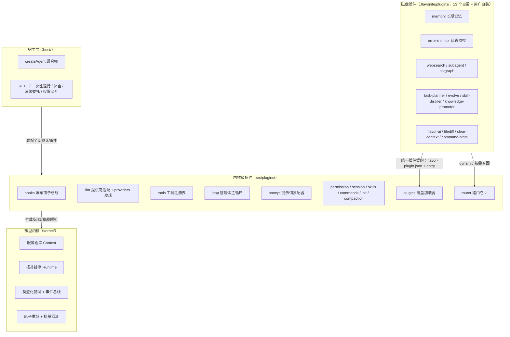
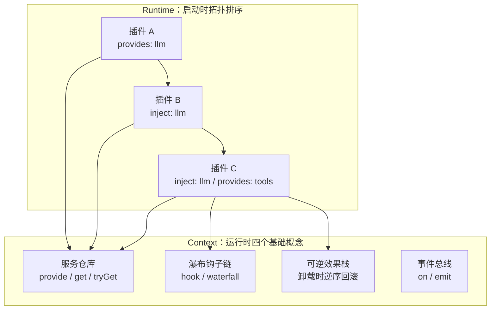
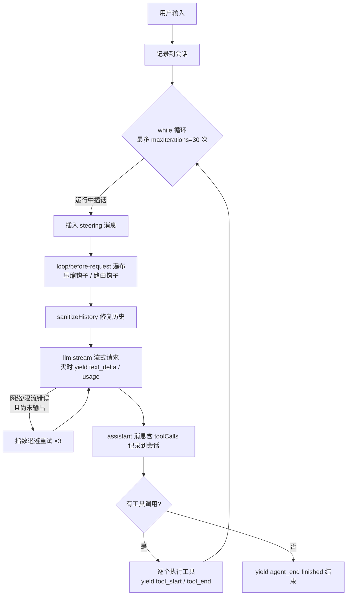
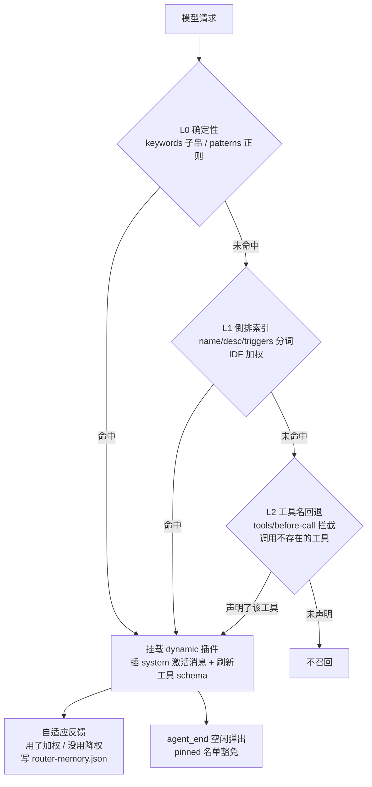
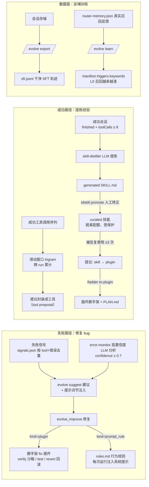
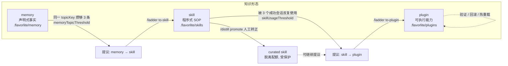

# flavor-lite 技术方案报告

> 本文档是 flavor-lite 的技术方案报告：讲清系统的架构设计、核心机制与扩展方式，不记录版本演进历史（版本明细见 `CHANGELOG.md`）。
> 测试验证：`npm test` 实测 **23 个测试文件 / 320 个用例，全部通过**。

---

## 一、这是什么项目？

**flavor-lite** 是一个**轻量级 AI 编程助手（coding agent）**，用 TypeScript 编写。它不是一个传统的框架，而是一个**"万物皆插件"（Everything is a plugin）**的微型内核——整个智能体循环（agent loop）本身都是插件。

简单说：你向它下达一个任务（比如"帮我在 README 里加一段测试说明"），它会像一个人一样——
读代码 → 想方案 → 调用工具（读文件、改文件、跑命令）→ 再读结果 → 继续思考，直到完成。

### 它借鉴了哪些思想？

| 灵感来源 | 借鉴了什么 |
|---|---|
| deepseek-harness (Cordis) | 微型内核 + 可插拔能力缝（plugin seams） |
| flavor-code | 权限模式、FLAVOR.md 项目指南、JSONL 会话、分节的系统提示词 |
| pi | 事件驱动的流式循环、steering 消息（运行中实时插话）、工具钩子 |

### 为什么它"快"？

- **零 SDK 依赖**：调用大模型用的是原生 `fetch` + 手动解析 SSE 流，唯一运行时依赖是 `zod`（做配置校验）
- **不做二次审阅**：只有一条流，直接输出到终端
- **启动时一次性拓扑排序**：插件加载顺序启动时确定，运行期零分发开销
- **实时流式输出**：文本逐字到达，逐字渲染
- **只在值得重试的地方重试**：网络/限流错误在未输出任何内容前做指数退避重试

---

## 二、总体架构

系统分四层：**微型内核**（底座）→ **内核级插件**（能力缝）→ **宿主层**（组合根与终端）→ **磁盘插件**（用户可随时增删的能力）：



一句话概括：**内核只做"服务注册 + 依赖排序 + 生命周期管理"三件事，其余全部是插件**；而磁盘插件让"扩展能力"从"改源码"降级为"放一个目录"。

---

## 三、技术栈与工程配置

| 项目 | 内容 |
|---|---|
| 语言 | TypeScript（strict 模式 + `noUncheckedIndexedAccess`） |
| 包管理器 | npm |
| Node 要求 | >= 20（astgraph 插件额外要求 >= 22.5，用 `node:sqlite`） |
| 运行时依赖 | 仅 `zod`（^4.4.3） |
| 开发依赖 | `tsup`（打包）、`typescript@7`、`vitest`（测试） |
| 输出格式 | ESM，`tsup` 打包成 `dist/cli.js` 和 `dist/index.js` |
| 入口 | CLI 二进制：`flavor-lite`；SDK 入口：`src/index.ts` |

### 常用命令

```bash
npm test          # 运行全部单元测试（vitest）
npm run typecheck # 类型检查（tsc --noEmit）
npm run build     # tsup 打包到 dist/
npm start         # node dist/cli.js 启动
```

### 工程文件速览

- `tsconfig.json`：严格类型检查，`noEmit`（打包交给 tsup）
- `tsup.config.ts`：入口 `cli` 和 `index`，只输出 ESM；`dts` 关闭（TypeScript 7 兼容问题），需要类型声明时跑 `npm run types`
- `vitest.config.ts`：只收集 `tests/**/*.test.ts`，Node 环境，超时 20 秒
- `.env.example`：模板，只需设置一个 API Key（OpenAI 系或 Anthropic 系）即可运行
- `CHANGELOG.md`：**版本变更记录**（README 与本文档不承载版本历史）
- `docs/plugin-dev.md`：**插件开发规范**，磁盘插件契约的唯一权威文档
- `docs/evolve.md`：**插件模式自进化路线图**（现状盘点 → 缺口分析 → 分优先级路线图 → 反模式清单）
- `docs/self-evolve.md`：**自进化方向探索报告**（五个方向评估 + 优先级建议）
- `docs/specs/`：**SDD 规格文档**（`evolve-enhance.md`、`skill-distiller.md`、`task-planner-persistence.md`、`evolve-batch2.md`、`knowledge-promoter.md`）
- `templates/plugin-template/`：`/plugin new` 用的脚手架模板（源码里也内嵌了一份，保证 dist 自包含）

---

## 四、目录结构

```
flavor-lite/
├── src/
│   ├── index.ts                  # 公共 SDK 出口：把内核和所有插件统一导出
│   ├── cli.ts                    # CLI 入口：解析参数 → createAgent → REPL 或一次性运行
│   ├── kernel/                   # 微型内核（mini-Cordis）
│   │   ├── types.ts              #   类型：Plugin、PluginContext、KernelOptions、ServiceMap 等
│   │   ├── context.ts            #   上下文：服务仓库 + 可逆效果栈 + 服务所有权 + whenAvailable
│   │   ├── runtime.ts            #   运行时：挂载/拓扑排序/逆序卸载 + 原子重载 + 事件总线
│   │   ├── errors.ts             #   类型化内核错误：稳定错误码 + 结构化 detail
│   │   └── index.ts              #   内核公共出口
│   ├── shared/
│   │   └── messages.ts           # 与厂商无关的消息模型 + 历史清洗
│   ├── plugins/                  # 内核级能力插件
│   │   ├── hooks/                #   瀑布钩子总线插件（hooks 服务）
│   │   ├── llm/                  #   大模型能力缝：适配器注册表、SSE 解析
│   │   │   ├── providers.ts      #   提供商发现插件化：openai/anthropic 各自独立成插件
│   │   ├── tools/                #   工具能力缝：工具注册表 + before/after 钩子 + 7 个内置工具
│   │   ├── permission/           #   权限插件：4 种模式 + 危险命令硬拦截
│   │   ├── session/              #   会话插件：.flavorlite/sessions 下的 JSONL 持久化
│   │   ├── prompt/               #   提示词插件：纯装配器，只负责拼接各插件贡献的节
│   │   ├── guidance/             #   引导插件：身份/安全/任务/环境 四个提示词节
│   │   ├── loop/                 #   智能体循环插件：流式、steering、重试、压缩钩子
│   │   ├── compaction/           #   历史压缩插件：主动+被动裁剪上下文
│   │   ├── skills/               #   技能插件：SKILL.md 发现 → 提示词节
│   │   ├── commands/             #   斜杠命令注册表
│   │   ├── init/                 #   项目指南插件：FLAVOR.md 注入 + /init 生成器
│   │   ├── plugins/              #   磁盘插件加载器：发现/热重载/目录监听/脚手架
│   │   │   └── template.ts       #       /plugin new 的内嵌脚手架模板
│   │   └── router/               #   路由插件：dynamic 插件按需召回 + 空闲弹出
│   └── host/                     # 宿主层：装配、配置合并、终端交互、渲染、REPL
│       ├── bootstrap.ts          #   createAgent：唯一的组合根，挂载全部默认插件
│       ├── config.ts             #   多源配置合并（用户/项目/环境/CLI），zod 校验
│       ├── interaction.ts        #   终端交互实现（权限确认）
│       ├── render.ts             #   事件渲染：零依赖 ANSI 颜色；可委托给 ui 服务
│       ├── completions.ts        #   REPL 补全控制器：repl 服务 + 建议渲染 + Tab 补全
│       └── repl.ts               #   交互式 REPL
├── docs/
│   ├── plugin-dev.md             # 插件开发规范
│   └── specs/                    # 自进化 SDD 规格（evolve-enhance / skill-distiller / task-planner-persistence / evolve-batch2 / knowledge-promoter）
├── templates/
│   └── plugin-template/          # /plugin new 脚手架模板
├── .flavorlite/plugins/          # 磁盘插件根（本项目自带的 13 个插件）
│   ├── memory/                   #   长期记忆：BM25 + 向量 + RRF 混合检索
│   ├── error-monitor/            #   工具错误监控 + LLM 分析蒸馏到记忆
│   ├── websearch/                #   网络搜索：DuckDuckGo / Brave / SearXNG
│   ├── subagent/                 #   子代理：最多 3 层嵌套，独立会话
│   ├── astgraph/                 #   代码图谱：ast_search/callers/callees/impact/context
│   ├── flavor-ui/                #   时间线 UI：banner、spinner、工具卡片
│   ├── filediff/                 #   文件修改后终端打印 +/- diff
│   ├── clear-context/            #   /clear：清屏 + 重置上下文
│   ├── command-hints/            #   REPL 斜杠补全候选提供者
│   ├── task-planner/             #   任务规划：彩色任务面板 + plan_end 归档 + /plan-log
│   ├── evolve/                   #   自进化 RSI 闭环：失败建议 + 成功 trigram 工具提议 + prompt_rule 规则 + SFT 导出 + triggers 回写 + 信号联动
│   ├── skill-distiller/          #   成功会话自沉淀 SOP + /distill promote 晋升
│   └── knowledge-promoter/       #   知识晋升阶梯：memory→skill→plugin 提议与转化（/ladder）
├── tests/                        # 23 个测试文件，320 个用例
└── dist/                         # 构建产物（已 gitignore）
```

---

## 五、核心架构：微型内核

整个项目最核心的设计是 **kernel**，它提供了 4 个基础概念，所有插件都建立在这些概念之上。



### 1. 服务仓库（Context 是什么？）

`Context`（`src/kernel/context.ts`）就是一个**按字符串键存储服务的 Map**，加上事件总线和效果栈。所有插件通过它互相通信，而不是互相 import。

- `ctx.provide(key, service)`：注册一个服务，返回一个"撤销函数"
- `ctx.get(key)`：取服务，**取不到就抛错**（fail loud，绝不静默）
- `ctx.tryGet(key)`：取服务，取不到返回 `undefined`
- `ctx.emit / ctx.on`：事件发布 / 订阅（观察者模式）
- `ctx.hook / ctx.waterfall`：**瀑布钩子**（见下文）
- `ctx.effect(setup)`：登记一个可逆效果，卸载时按**逆序**回滚

```ts
// 一段生动的理解：
ctx.provide("llm", llmService)   // 谁需要大模型，就 ctx.get("llm")
const dispose = ctx.on("event", handler)  // 订阅事件
dispose()                          // 随时可退订，一切可逆
```

### 2. 瀑布钩子（Waterfall，环绕中间件）

瀑布钩子独立成 `hooks` 插件（`src/plugins/hooks/index.ts`）。内核只保留服务仓库和效果栈，环绕中间件全部住在 hooks 插件里——**卸掉这个插件，就不存在任何钩子点了**，"插件，而不是改循环"的纯度更高。

```ts
ctx.hook("tools/before-call", async (event, next) => {
  console.log("工具要开始跑啦");
  const result = await next(event);   // 传给下一层
  console.log("工具跑完了");
  return result;
});
```

特性：`hook(name, listener, { prepend: true })` 可以把监听器插到链头（最外层）——路由、策略类插件靠它保证在任何其他监听器之前看到载荷。

### 3. 插件的声明式元数据

每个插件声明 `name`（名字）、`inject`（需要哪些服务）、`provides`（提供哪些服务）、`apply`（激活逻辑，返回一个卸载函数）：

```ts
export const myPlugin = definePlugin({
  name: "my-plugin",
  inject: ["tools"],        // 依赖的工具服务
  apply(ctx) {
    return ctx.effect(() => {
      const dispose = ctx.hook("tools/before-call", ...);
      return dispose;       // 卸载时自动回滚
    }, "my-plugin.install");
  },
});
```

### 4. 启动时的拓扑排序（Runtime）

`Runtime`（`src/kernel/runtime.ts`）启动时根据 `inject`/`provides` 做**拓扑排序**——不管插件按什么顺序挂载，有依赖的插件一定在提供者之后激活：

- 依赖缺失 → 启动即抛错
- 服务重复提供 → 启动即抛错
- 依赖成环 → 启动即抛错（还会打印出环的路径）

这种"错在启动时爆、不在运行中藏"的设计，是整个项目"fail loud"哲学的体现。卸载时则按激活的**逆序**逐个执行卸载函数，保证世界干净地回到原点。

### 5. 提供商发现也插件化了

`src/plugins/llm/providers.ts`：OpenAI / Anthropic 各自是独立插件（`openaiProviderPlugin` / `anthropicProviderPlugin`），有 API Key 就自我注册适配器，没有就静默跳过。组合根（bootstrap）**完全不碰适配器实现和环境变量**，只做一个通用检查：无论内置还是第三方，只要最终 `llm.providers().length === 0` 就启动即抛错。第三方提供商现在可以走和内置一模一样的路径。

### 6. 内核稳定性与可运维性机制

内核的形状保持"上下文 + 拓扑排序运行时"不变，在四个方向上把内核补硬：

#### 6.1 类型化内核错误（`kernel/errors.ts`）

所有内核失败都带**稳定错误码** + **结构化 `detail`**，宿主和监控按码分支，而不是解析错误文案。完整错误码表：

| 错误码 | 含义 |
|---|---|
| `runtime/disposed` | 运行时/上下文已销毁（`DisposedError`） |
| `kernel/limit-exceeded` | 超过资源上限（`LimitExceededError`） |
| `resolution/missing-provider` / `cycle` / `duplicate-provider` | 依赖解析失败（`ResolutionError`，带涉及条目） |
| `activation/failed` / `timeout` / `invalid-config` | 激活失败 / 超时 / 配置校验失败（`ActivationError` / `ConfigValidationError`） |
| `service/ownership` | 跨插件覆盖服务未声明 `override`（`OwnershipError`） |
| `service/undeclared` | 注册了 `provides` 清单之外的服务（`UndeclaredServiceError`） |
| `reload/provider-mismatch` / `in-progress` | 重载被拒（`ReloadError`） |
| `unmount/dangling-consumers` | 卸载会留下悬空消费者（`UnmountError`） |

所有错误类都继承 `KernelError`（code + detail + cause 链保留原始错误）。

#### 6.2 服务所有权与声明契约

- **所有权**：`ctx.provide()` 注册的服务归"激活它的插件"所有——所有者身份通过 `AsyncLocalStorage` 传播，所以**异步 `apply()` 在 await 之后注册的效果/服务依然归属正确插件**。跨插件覆盖另一个插件的服务是启动错误，除非显式 `{ override: true }`（有意的遮蔽）。
- **声明契约**：插件声明了 `provides: [...]` 就只能在清单内注册服务，越界即 `service/undeclared` 激活失败。`provides` 从"元数据"变成了**运行时强制的契约**。

#### 6.3 原子重载（`runtime.reload(name, replacement)`）

磁盘插件热重载从"卸载 → 重装"两步（中间消费者会短暂拿不到服务）变成原子的：

```
旧实例运行中 → 新实例先激活（pre-activate）→ 新实例接管旧实例的服务注册
              → 旧实例 teardown → 成功则提交、失败则回滚（旧实例原样保留）
```

- 消费者**永远看不到服务间隙**（takeover 记录 + 提交/回滚机制）
- 重载失败时旧实例完整保留，错误抛 `ReloadError`
- 同一插件的并发重载被拒绝（`reload/in-progress`）

#### 6.4 异步激活、批量回滚与超时控制

- `apply()` 可以是 async 的；激活按 **batch** 组织，任一插件失败，整个 batch 逆序回滚，已注册的服务/效果全部撤掉，`activePlugins()` 回到干净状态
- 惰性销毁器（`onceDisposer`）：销毁器只执行一次，防并发销毁导致的双重释放
- `activationTimeoutMs`：异步激活超时即 `activation/timeout` 失败（同步 apply 无法超时，长同步任务应改异步并观察 `ctx.signal`）
- `teardownTimeoutMs`：teardown 挂起时警告并继续，**关机永不卡死**

#### 6.5 内核事件总线（`runtime.on()`）

`runtime.on(type, listener)` 订阅内核生命周期事件（返回退订函数）：

- `plugin:activating` / `plugin:activated` / `plugin:failed` / `plugin:unmounted`（带 `instanceId` + `name`）
- `batch:rolled-back`（带涉及插件列表与错误）
- `service:provided` / `service:removed`（带 key + owner）
- `runtime:disposed`（保证在 dispose 完成后发出，即使部分 teardown 失败）

#### 6.6 资源上限与迟到服务

- **资源上限**：`KernelOptions` 新增 `maxEffects` / `maxServices` / `maxListenersPerEvent` 三个硬上限。注册时即校验，超限抛 `LimitExceededError`（`kernel/limit-exceeded`）——失控插件**不可能无界增长内核状态**。`maxServices` 只对"新 key"计数，遮蔽已有 key 不涨。
- **迟到服务**：`ctx.whenAvailable(key, signal?)` —— 服务现在存在就立即解析，否则挂起等待（磁盘 dynamic 插件在 `start()` 之后挂载，服务可能"迟到"）。context 销毁时以 `DisposedError` 拒绝，调用方 abort 时以 abort reason 拒绝。适合一次性等待；需要反复读可能被弹出/重新挂载的服务仍建议 `tryGet()`。

#### 6.7 可观测性

- `runtime.inspect()` → `RuntimeSnapshot`：服务清单（含 owner）、激活插件、效果、注册表状态
- `runtime.plan()`：预览拓扑排序结果（有序列表 + 解析错误），不动任何状态
- 结构化日志：`Logger` 接口带 `LogFields`（plugin / serviceKey / code ...），机器消费者不用解析文本
- `effectStackTraces`：为效果捕获注册时的调用栈（诊断用）

#### 6.8 Standard Schema v1 配置校验

插件 `config` 字段支持 **Standard Schema v1**（zod、valibot、arktype 等共通的厂商中立接口，内核保持零依赖只是结构性地引用）。apply() 之前先校验，失败抛 `activation/invalid-config`，校验通过（可含 transform）后的值传给 `apply(ctx, config)`。

---

## 六、消息模型（Model-visible ⇔ Logged）

`src/shared/messages.ts` 定义了与厂商无关的消息模型：

- `user`：用户消息（纯文本）
- `assistant`：助手消息（文本 + 可选 toolCalls）
- `tool`：工具结果（对应某个 toolCallId）

`sanitizeHistory()` 是一个很聪明的**历史修复函数**：如果对话中助手发起了工具调用但结果不完整（比如中途被中止、会话文件写了一半、压缩裁掉了），直接发给模型会被拒绝。它会把悬空的工具调用组改写成普通文本、丢弃孤儿工具结果，保证**任何情况下发给模型的历史都是合法的**。

会话插件坚持"模型能看到的 ⇔ 被记录的"：所有进入模型请求的消息都会被追加到会话 JSONL，因此一个会话文件可以完整还原一段对话。

---

## 七、能力缝插件详解

### 1. LLM 插件（`plugins/llm/`）——大模型提供商

- 提供 `llm` 服务，内部是一个**适配器注册表**
- 每个提供商是一个 `ModelAdapter`（`stream(request)` 返回异步事件流）
- 模型引用形式是 `"provider:model"`，比如 `openai:gpt-5`、`anthropic:claude-sonnet-4-5`；裸名字默认归到 `openai`
- **OpenAIAdapter**：兼容 OpenAI、DeepSeek、Moonshot、vLLM、Ollama 等任何 OpenAI 兼容网关，纯 `fetch` + SSE 流式解析，自动累加 tool_calls 分片
- **AnthropicAdapter**：走 Anthropic Messages API，同样纯 fetch 流式
- 错误统一归一化为 `ProviderError`，带语义化错误码：`authentication`（401/403）、`rate_limit`（429）、`context_overflow`、`model_not_found`、`network`、`cancelled`
- **提供商注册是独立插件**（见第五节第 5 点），第三方可完全复刻

### 2. 工具插件（`plugins/tools/`）——智能体的"手脚"

工具注册表（`ToolRegistry`）提供 4 类工具，每个工具都声明自己的 JSON Schema：

| 类别 | 工具 | 说明 |
|---|---|---|
| read | `Read` | 读文件，支持 offset/limit，超 120k 字符自动截断 |
| write | `Write` | 写文件（自动建父目录） |
| write | `Edit` | 精确文本替换，支持 replaceAll |
| read | `Glob` | 按通配符找文件（`**`、`*`、`?`），纯 Node 实现 |
| read | `Grep` | 正则搜索文件内容，跳过二进制，限制 200 条 |
| shell | `Shell` | 跑命令，带超时（默认 120s）和输出截断 |
| control | `TodoWrite` | 任务清单跟踪（进程内状态） |

工具执行时先过 `tools/before-call` 瀑布（权限插件在这里拦截），再执行，最后过 `tools/after-call` 瀑布（可改写结果）。**执行任何工具都不会抛异常**——错误会变成 `isError: true` 的结果返回给模型，让模型自行修复。

安全细节：所有文件工具都做**工作区边界检查**（`isWithinWorkspace`），禁止 `..` 逃逸。

### 3. 权限插件（`plugins/permission/`）——安全护栏

四种权限模式：

| 模式 | 行为 |
|---|---|
| `plan` | 只读；写文件、shell 全部拦截 |
| `default` | 读自动放行；写、shell 按类别询问一次 |
| `acceptEdits` | 读+写自动放行；shell 询问 |
| `bypass` | 全部放行（除了下面的硬危险命令） |

**任何模式下都硬拦截**的危险命令模式包括：`rm -rf /`、`mkfs`、`format C:`、`dd of=/dev/`、关机/重启、fork 炸弹、注册表删除等。

询问需要 `interaction` 服务（CLI 里是终端交互）。**没有 interaction 服务时默认拒绝**（fail closed）。批准按 `模式:类别:目录` 记录，一次批准本会话内记住，切换模式会清空记忆。

### 4. 会话插件（`plugins/session/`）——JSONL 持久化

- 每个会话是一个文件：`.flavorlite/sessions/<时间戳>-<随机数>.jsonl`
- 追加式写入，每行一个 JSON（header/message/title）
- 打开时会**隔离损坏的行**（崩溃残留的截断行被跳过，不丢整个文件）
- 提供 `create/open/latest/list` 服务，支持 `/sessions`、`/resume`、`/new` 命令

### 5. 提示词插件（`plugins/prompt/`）——纯装配器

系统提示词是**运行时拼出来的**：`prompt/assemble` 瀑布从空节列表开始，各插件往 `sections` 里推自己的节，最后去重（同名后者覆盖）、按 `# 节名` 格式拼接。

谁贡献节？

- `guidance` 插件：Identity（身份）、Security（安全）、Tasks（任务）、Environment（环境）
- `permission` 插件：Permissions（当前模式）
- `shell` 工具插件：Shell（平台提示）
- `skills` 插件：Skills（可用技能）
- `init` 插件：Project guide（FLAVOR.md 内容）
- **磁盘插件**：memory（用户偏好）、error-monitor（过往错误教训）、subagent（委派指引）、flavor-ui 等各插自己的节

**卸掉某个插件，它的节就消失**——系统提示词完全由插件决定，这是"一切皆插件"最直观的体现。

### 6. 循环插件（`plugins/loop/`）——智能体的主循环

`agent` 服务实现 `run(options)` 异步事件流。一次 `run` 的流程：



特性：
- **Steering**：turn 运行中输入的文字会变成 `[steering] ...` 用户消息，注入到下一个模型请求之前——不用重启就能实时指挥
- **Abort**：`Ctrl+C` 中止当前 turn；被中止的工具调用会记录占位结果，保证会话数据"线格式合法"
- **Context overflow**：上下文溢出时调用 `loop/compact` 瀑布让压缩插件裁剪一次后重试
- **警告**：到达迭代上限 80% 时发 warning；`stopReason=length` 时也提示

### 7. 压缩插件（`plugins/compaction/`）——上下文瘦身

- **主动压缩**：挂在 `loop/before-request` 上，历史足迹超过预算（默认 160k 字符 ≈ 40k token）时裁剪中间部分，换成一条 `[system] Earlier conversation ...` 标记，尾部保留（默认 20 条）且裁切边界会回退，**绝不让工具结果成为第一条**
- **被动压缩**：挂在 `loop/compact` 上，处理提供商仍报 context overflow 的情况

### 8. 其他内核级插件

- **skills**：扫描 `.flavorlite/skills/<name>/SKILL.md`（项目）和 `~/.flavorlite/skills/`（用户全局），只把技能的名字和描述注入提示词，模型用到时再用 Read 工具读全文——保持提示词精简
- **commands**：斜杠命令注册表，宿主与插件都能注册
- **init**：FLAVOR.md 项目指南作为提示词节注入；`/init` 让 agent 自己探索项目并生成 `.flavorlite/FLAVOR.md`

---

## 八、磁盘插件系统（`.flavorlite/plugins/`）

**不用改 flavor-lite 源码，往项目里放一个目录就是新插件，改完 `/plugin reload` 即刻生效**。磁盘插件与内置插件使用完全相同的契约。

### 1. 加载器插件（`src/plugins/plugins/`）——发现、热重载、监听

- **发现根**：`<项目>/.flavorlite/plugins/`（项目）→ `~/.flavorlite/plugins/`（用户全局），同名按 manifest 里的 `name` 项目遮蔽用户
- **目录结构**：每个插件 = `flavor-plugin.json`（manifest）+ ESM entry（默认 `index.js`），默认导出 `Plugin` 或 `Plugin[]`
- **manifest 字段**：`name`（必填）、`version`、`entry`、`description`、`config`（透传给 `apply(ctx, config)`）、`activation`（`eager` 启动即挂载 / `dynamic` 进目录但先不挂载，等路由插件召回）、`triggers`（路由提示：keywords / patterns / tools / commands）、`provides`（声明的服务键，用于跨插件依赖解析）
- **热重载**：`/plugin reload <name>` 卸载（按逆序跑 disposer）→ 用 cache-busting query 重新 import → 重挂载；`/plugin reload` 全量重发现，新目录自动出现、删除的自动卸载
- **目录监听**（默认开）：新插件自动进目录、移除的自动卸载；**已加载的插件永不被自动 sync 触碰**——正在跑的 turn 绝不被干扰，要换只能手动 `/plugin reload`
- **坏插件绝不炸宿主**：manifest 非法、import 失败、激活失败，全部标记为 `error` 记在目录里，其余继续跑
- **依赖解析**：eager 插件可以 inject 另一个磁盘插件提供的服务，加载器按 `provides` 声明递归装载 + 拓扑排序；eager 依赖 dynamic 提供的服务会启动即报错
- **/plugin 命令**：`list`（状态 + 错误 + provides）、`reload [name]`、`new <name>`（脚手架，从内嵌模板生成目录）
- **脚手架模板**（`templates/plugin-template/` + `src/plugins/plugins/template.ts`）：内嵌一份在源码里保证 dist 自包含；`/plugin new` 生成的工具/命令/提示词节三合一样板

### 2. 路由插件（`src/plugins/router/`）——dynamic 插件按需召回

dynamic 插件平时不占内存不占提示词；每个模型请求过一个**三级召回漏斗**，每次 `agent_end` 把没用上的弹出去：



- **L0 确定性**：manifest 声明的 `keywords`（大小写不敏感子串）/ `patterns`（正则）命中即召回——作者控制的精确匹配，微秒级
- **L1 倒排索引**：对 name / description / triggers 做 tokenize（英文单词 + CJK 单字/二元组，带停用词表），构建 IDF 加权倒排索引；目录变化才重建，查询路径是纯查找
- **L2 工具名回退**：挂在 `tools/before-call` 上——模型调了一个"当前不存在"的工具，如果某 dynamic 插件声明了它，当场挂载再执行——**零漏召回**
- **自适应反馈**：召回但没用上的配对降权、用了的加权，写入 `.flavorlite/router-memory.json`（滚动 200 条）；用指纹（去重排序的 token）判断"相似请求"，L0 命中永不绝不降权（作者声明是精确信号）
- **空闲弹出**：turn 结束时把加载了但没用到工具、也没有反向依赖的 dynamic 插件 eject 回目录（`pinned` 名单可豁免）
- 召回时往请求里插一条 `[system] Plugins activated for this task: ...` 消息并刷新工具 schema，让模型知道新工具可用

### 3. 自带磁盘插件（本项目 `.flavorlite/plugins/` 下的 13 个）

#### memory —— 长期记忆
- 存储：`.flavorlite/memory/MEMORY.md` 路由索引 + `tasks/<id>.md` 全文，文件锁 + 原子改名 + `.bak` 兜底，崩溃不丢
- 去重：归一化 + `similarity >= 0.92` 拒绝近似重复
- **混合检索**：BM25（稀疏）+ 外部 embedding 向量（稠密，OpenAI 兼容端点，Ollama 也可）→ **RRF 融合**；热度调制（hot +15% / cold −25%）
- 热度老化：7 天内召回 >10 次 = hot；3 天没动 = cold（`/forget-cold` 清理）
- 自动召回：`loop/before-request` 每轮把 top hits 追加进系统提示词（按 query 缓存）
- 自动提取：`loop/after-run` 用 agent 自己的 LLM 从对话里提取持久事实，置信度 ≥ 11/12 才自动入库；敏感内容（密钥、注入文本）拒绝
- 命令：`/memory`、`/remember`、`/forget`、`/forget-cold`、`/embedding`

#### error-monitor —— 错误监控 + LLM 蒸馏
- `tools/after-call` 钩子捕获 `isError: true` 的工具结果，按签名去重记录到 `.flavorlite/error-monitor/records.json`（`/errors` 查看）
- 对**每个新失败**，后台调用 LLM 分析（带平台/shell/cwd 环境、脱敏后的错误文本），要求返回严格 JSON `{"analysis": "...", "confidence": 0.0-1.0}`
- 只有 `confidence >= 0.7` 的分析才蒸馏成 `feedback` 记忆写进 memory 插件（`memoryStatus` 记录在每条 record 上，`/errors` 可直接看到 skipped 原因）
- 防呆：20s 超时中止、指数退避重试、串行化防爆、推理模型关 CoT（`thinking: "disabled"`）；LLM 失败默认**不写记忆**（除非显式 `fallbackToRules: true`）
- 教训注入：`prompt/assemble` 把最近的教训注入系统提示词，让模型在下一次规划工具前看到历史失败
- 命令：`/errors`、`/errors clear`、`/errors analyze`（对空回复的旧记录重新蒸馏）

#### websearch —— 网络搜索（dynamic）
- 工具 `websearch`（`query` / `maxResults` / `region`），category `read` 全权限放行
- 三提供商：DuckDuckGo lite（免费默认）、Brave API（需要 key）、自定义 SearXNG JSON 端点
- 零依赖纯 ESM，只用 Node 内置 fetch；超时/HTTP 错误作为错误结果返回给模型、绝不 throw
- 触发词包括中文（搜索/查一下/查资料/网页/新闻…）与英文（web/search）；`/websearch` REPL 命令是工具薄封装

#### subagent —— 子代理
- 工具 `subagent_spawn`（`task` / `role` / `maxIterations`）：让 agent 委派子任务给全新子代理
- 子代理：**独立会话**（历史不污染父级，父级只看最终报告）、专属系统提示词节（角色/任务/深度）、与父级相同的工具与权限策略、继承父级 abort 信号
- **最多 3 层嵌套**（root → child → grandchild → great-grandchild），深度用 `AsyncLocalStorage` 跟踪，不需要改 loop
- 报告保障三层：提示词预留迭代 → 静默时驱动 2 次收尾轮 → 仍静默就从会话日志重建工具调用摘要；报告头总带子会话 id 便于父级查全程
- 被拒绝的 spawn 不落盘（没有孤儿会话文件）

#### astgraph —— 代码图谱（dynamic，Node >= 22.5）
- 从 flavor-code 移植：用 tree-sitter（WASM）构建函数/类/接口/类型的调用、import、继承边，存进 `.flavorlite/astgraph/index.db`（`node:sqlite`，WAL）
- 工具：`ast_search` / `ast_callers` / `ast_callees` / `ast_impact` / `ast_context`
- 命令 `/ast`：init / sync / status / search / impact / callers / callees / context
- 懒加载：激活只注册处理器，WASM 语法与数据库首次使用才载入；`tools/after-call` 对文件修改做增量同步
- 低版本 Node 上加载正常、查询时给友好错误

#### flavor-ui —— 时间线 UI
- 宿主只拥有终端，但把渲染委托给可选的 `ui` 服务（`provides: ["ui"]`）——这个插件接管整个观感
- 每轮 turn 变成时间线：输入回显、模型文本实时流、工具调用 live 状态行（TTY 下 spinner 原地重写）、结尾 dim 统计行（turn 数 / token / 耗时）
- 启动 banner 变成状态卡片：版本、模型、权限模式（语义着色）、会话 id、插件健康、失败插件告警
- `/ui` 查看/切换样式（full 动画 / plain 静态）；非 TTY / `NO_COLOR` 自动退化为纯文本
- 卸载即恢复宿主默认渲染，无残留状态

#### filediff —— 文件变更 diff
- 文件修改工具（Write/Edit/ApplyPatch 及带 path 的 write 类工具）跑完后，终端立刻打印彩色 `+/-` diff
- 识别 shell 删除（rm/unlink/del/erase/rmdir/rd）与移动（mv/move/ren/rename）；目录递归扫描（有上限）
- diff 直接写 stdout、**绝不污染模型可见的工具结果**（ANSI 不进上下文）
- 可配置 color / maxDiffLines / maxFileBytes / maxTreeFiles

#### clear-context —— `/clear`
- 清屏（ANSI 转义）+ 重置上下文：会话文件重写为只剩 header，`loop/before-request` 把 clear 之前的消息从每次请求里裁掉
- 重写失败时请求时裁剪兜底，旧上下文仍然到不了模型

#### command-hints —— REPL 补全候选
- 输入以 `/` 开头时，把命令、插件、技能名渲染在输入行下方，前缀高亮，Tab 循环补全（命令 → `/name`；插件 → `/plugin reload <name>`；技能仅展示信息）
- 一次性 `-p` 模式下无 REPL，优雅 no-op

#### task-planner —— 任务规划面板
- 工具 `plan_start` / `plan_update` / `plan_view`：把复杂工作拆成原子任务，彩色面板（running 绿 / pending 橙 / error 红 / done 暗）直接画到终端
- 面板只在终端显示，模型只拿纯文本摘要——颜色不污染上下文
- `control` 类工具在 default/plan 模式下免询问，agent 可以自主规划
- `plan_end` 把 goal + 任务终态 + outcome 归档到 `.flavorlite/task-planner/plans.jsonl` 并清空内存；`/plan-log [n]` 列出最近归档

#### evolve —— 自进化 RSI 闭环
- 捕获：`tools/after-call` 记失败信号（按 tool+归一化错误去重），成功调用名进 run 缓冲
- 聚合：`loop/after-run` 统计失败 + 提炼成功 trigram（`patterns.jsonl`，同 run 只计 1 次）
- 评估：`prompt/assemble` 注入建议（失败建议 + `(tool proposal)` 工具提议 + `[em:]` 已分析错误）
- 改进：`evolve_improve` 工具 —— `kind=plugin` 脚手架 fix 插件；`kind=prompt_rule` 把修复沉淀为 `rules.md` 规则并在每次运行注入系统提示
- 验证：`/evolve verify` 沙箱 dry-run、`/evolve test` 跑测试套件、`/evolve revert` 快照回滚
- `/evolve export [limit]`：把会话清洗成干净 SFT 轨迹写 `sft.jsonl`（只留 user/assistant 纯文本、丢 steering 元消息、短会话跳过）
- `/evolve learn`：把 router-memory.json 里"召回且被用"的 token 回写成 manifest `triggers.keywords`（L0 确定性召回，幂等）
- 信号联动：`/evolve suggest` 与 `evolve_improve` 消费 error-monitor 的高置信度 LLM 分析（`em:` 条目，文件级集成，error-monitor 零改动）
- 命令：`/evolve signals|suggest|improve|verify|revert|test|clear|done|export [limit]|learn`

#### skill-distiller —— 成功会话自沉淀 SOP
- 门槛：`loop/after-run` 且 `reason=finished`、`toolCalls >= 8`、生成总量 < 20、slug 不冲突
- LLM 提炼：喂会话 transcript + 既有 skill 名单，严格 JSON 返回 `{"skip": true}` 或 `{"name","description","body"}`
- 落盘：`.flavorlite/skills/<slug>/SKILL.md`（front-matter 带 `generated: true`），下次会话被 skills 插件自动发现注入
- `/distill promote <slug>`：人工把关——把 generated 技能"转正"为 curated（`generated: false` + `promoted: true`），自动释放生成配额并受 `/distill rm` 保护
- 命令：`/distill` 列出（`(generated)` / `(promoted)` 标注）、`/distill rm <slug>` 只删生成的 skill（人写的拒绝删除）；fire-and-forget 不阻塞 loop

#### knowledge-promoter —— 知识晋升阶梯（新插件）
- 纯确定性逻辑、无 LLM 依赖：`memory → skill → plugin` 两段晋升提议，全部人工命令门控
- memory → skill：同一 `topicKey` 攒够 3 条（可配 `memoryTopicThreshold`）→ 提议；`/ladder to-skill <topic>` 用该主题全部 summary 合成 `SKILL.md` 草稿（`generated: true` + `promotedFrom: memory`，纳入 skill-distiller 管理面）
- skill → plugin：`loop/after-run` 扫描会话 transcript，技能被提及每 run 计 1 次（跨 run 累计）；≥ 3 次（可配 `skillUsageThreshold`）→ 提议；`/ladder to-plugin <slug>` 脚手架插件目录 + 写带技能正文的 PLAN.md
- 可见性：`prompt/assemble` 注入 `knowledge-promoter` 节（有提议才注入，上限 8 条）+ `/ladder` 列出；处理过的主体标记 done 永不重复提议

---

## 九、自进化机制

自进化是一套**"捕获 → 聚合 → 评估 → 改进 → 验证"的 RSI 闭环**，全部由磁盘插件沿既有接缝（`tools/after-call`、`loop/after-run`、`prompt/assemble`）实现，**内核与 loop 零改动**。它不只修 bug，还让知识本身持续升值——从失败信号到行为规则，从成功会话到 SOP，再到可执行的插件。

### 1. 总体闭环



### 2. 失败闭环：信号 → 建议 → 修复 → 验证

- **捕获**：`tools/after-call` 记录失败信号（按 tool + 归一化错误去重，同错只涨 count）；成功调用名推进本次 run 的内存缓冲（只记名字不记参数值，无泄密面）
- **聚合**：`loop/after-run` 统计失败；对成功缓冲提取滑动窗口 trigram（**同一 run 内同一 trigram 只计 1 次**，跨 run 累计才有意义），按指纹去重写入 `patterns.jsonl`（上限 400 条）。某个序列跨 run 达到 `patternThreshold`（默认 3）次后，作为 `kind=tool` 建议（"(tool proposal)"）——**"把 Read→Grep→Write 这类高频序列封装成单个工具/命令"**
- **评估**：`prompt/assemble` 注入建议（失败建议 + 工具提议 + `[em:]` 已分析错误）；`/evolve suggest` 合并输出
- **改进**：`evolve_improve` 工具——`kind=plugin` 脚手架 fix 插件（`implementation` 写入 PLAN.md）；`kind=prompt_rule` 把修复归一化去重后追加到 `.flavorlite/evolve/rules.md`（一行一条），标记建议 done，不脚手架任何插件
- **验证**：`/evolve verify` 沙箱 dry-run、`/evolve test` 跑测试套件、`/evolve revert` 快照回滚
- 配置：`patternThreshold`(3) / `patternTop`(2) / `promptTop` / `minRepeats`

### 3. 信号联动：与 error-monitor 共享失败世界

evolve 自己的失败信号只有 `(tool, error)` 两维；error-monitor 却有更丰富的 `kind / analysis / confidence`（LLM 深度分析）。方案：**文件级集成，error-monitor 零改动**：

- evolve 容错读 `.flavorlite/error-monitor/records.json`，入选条件：有 `analysis` 且 `confidence >= 0.7`（可配 `emConfidence`）
- `/evolve suggest` 追加 `[em:<id>] (analyzed error)` 条目，id 前缀 `em:` 防止与信号指纹冲突，处理过的不再出现
- `evolve_improve` 的查找池并入这些条目，`plugin` / `prompt_rule` 两种修复方式都可用

### 4. 技能自沉淀：skill-distiller

补上 skills 体系缺的"生成"端，完全复用 memory 插件的 `extractMemories` 抽取模式（`collectLlmText` + fire-and-forget）：

- **门槛（防滥用）**：`loop/after-run` 且 `reason === "finished"`、`toolCalls >= minToolCalls`(8)、生成总量 < `maxGenerated`(20)、slug 目录不存在；`llm`/`session` 经 `ctx.tryGet` 惰性获取，缺任一静默跳过
- **LLM 契约**：喂完整会话 transcript（`session.latest()` → `open().messages()`）+ 既有 skill 名单，要求严格 JSON：`{"skip": true, "reason"}`（重复/无新知识）或 `{"name", "description", "body"}`；解析失败/skip/字段非法一律不落盘
- **落盘**：`.flavorlite/skills/<slug>/SKILL.md`，front-matter 带 `generated: true` + `distilledAt`，slug = name 小写转 `-`；下次会话 skills 插件自动发现注入
- **晋升（人工把关）**：`/distill promote <slug>` 把 front-matter 改成 `generated: false` + `promoted: true` + `promotedAt`——转正后自动释放一个生成配额（generated 计数只统计 `generated: true`），且 `/distill rm` 拒绝删除（人写的/转正的技能永远受保护）；列表显示 `(promoted)`
- **服务与命令**：provides `skillDistiller`（`idle()` 等全部 pending 提炼，供测试/诊断）；`/distill` 列出、`/distill rm <slug>` 只删 generated 的 skill，**人写的 skill 拒绝删除**

### 5. 知识晋升阶梯：knowledge-promoter

把三种知识形态（记忆 / 技能 / 插件）串成一张**晋升阶梯**——同一主题的记忆攒够了提议整理成技能、被反复使用的技能提议自动化成插件。全部**人工命令门控、纯确定性逻辑、无需 LLM**：



一句话记忆：**memory 是"知道"，skill 是"会做"，plugin 是"自动做"**——knowledge-promoter 负责提议升级，`/ladder` 负责人工确认，`/distill promote` 负责给好用的生成技能"转正"。

- **memory → skill 提议**：把长期记忆按 `topicKey` 分组，同一主题攒够 `memoryTopicThreshold`（默认 3）条就提议"把这堆记忆整理成技能"；`/ladder to-skill <topic>` 会把该主题所有条目的 summary 合成一份 `SKILL.md` 草稿（front-matter 带 `generated: true` + `promotedFrom: memory`，自动纳入 skill-distiller 的管理面——可以继续被 promote / rm / 配额保护）；slug 已存在则拒绝，成功后标记 done 不再提议
- **skill → plugin 提议**：每个 `finished` 的 run 结束后，扫描最新会话 transcript，只要提到某个已发现技能的 slug/名字就计 1 次使用（**每 run 每技能最多 +1**，跨 run 累计才有意义，和 evolve trigram 同一策略）；计数 ≥ `skillUsageThreshold`（默认 3）且还没生成同名插件 → 提议"把这段反复人工执行的工作流自动化成插件"；`/ladder to-plugin <slug>` 读技能正文、脚手架插件目录、写 PLAN.md（正文 + 实现/验证步骤），标记 done
- **提议可见性**：`prompt/assemble` 注入 `knowledge-promoter` 节（仅当有开放提议，上限 8 条），让模型在合适的任务里主动提起；`/ladder` 或 `/ladder suggest` 列出明细
- **存储**：`.flavorlite/knowledge-promoter/{skill-usage.json, done.json}`；提供 `knowledgePromoter` 服务，注册 `/ladder` 命令

### 6. 数据面：会话 → 训练语料

- **SFT 导出（`/evolve export [limit]`）**：会话文件（`.flavorlite/sessions/*.jsonl`）里混着 steering 插话、系统元消息等噪声，不能直接喂给微调/蒸馏管道。这个命令负责"洗干净"：
  - 数据源是可选服务 `session`（没有就友好提示，不报错）
  - 只保留 `user` / `assistant` 的纯文本消息，丢掉 `[steering]` / `[system]` 前缀的元消息；单条内容截断到 20000 字符
  - 过滤后消息不足 4 条的会话视为"没跑完"，跳过
  - 覆盖写 `.flavorlite/evolve/sft.jsonl`，每行一条 `{sessionId, exportedAt, messages}`
  - 边界很干净：**只读**会话存储，不碰 signals/reflections，`/evolve clear` 也不会误删导出物
- **triggers 回写（`/evolve learn`）**：路由插件的 L0 召回靠 manifest 里的 `keywords`，而自产/粗写插件的关键词往往不准。但 `router-memory.json` 已记了真实召回反馈，应反哺插件本身：
  - 容错读 `.flavorlite/router-memory.json`（缺失/损坏 → 友好提示）
  - 按插件统计每个 token 得分：`used: true` 的召回 +1，`used: false` 的召回 −1
  - 得分 ≥ 1 且长度 ≥ 2 的 token 合并进该插件 `triggers.keywords`（大小写不敏感去重，总数上限 16，2 空格缩进保持可读；写失败只跳过该插件，fail-safe）
  - **幂等**：重复执行不会重复新增；loader 的 watch 会自动同步目录
  - 效果：插件从"作者猜的关键词"进化成"真实召回验证过的关键词"，L0 确定性召回越来越准

### 7. 计划归档：task-planner `plan_end`

纯内存的任务板有了归档面，为"成功计划→模板、失败计划→反模式"留数据面：

- **`plan_start`**：计划对象新增 `startedAt`
- **`plan_end`（新工具，control）**：参数 `outcome`（success|partial|failed，必填），把 goal + 各任务终态 + 时间戳序列化追加到 `.flavorlite/task-planner/plans.jsonl`（一行一条），归档后清空内存态（plan_view 回到 "No active plan."）；无活动计划或非法 outcome → isError，且归档失败时**保留内存态不丢板**。终端打印归档提示
- **`/plan-log [n]`（新命令）**：列出最近 n 条（默认 10）归档：goal、outcome、done/总数、endedAt；无归档时给空提示
- GUIDANCE 补一条"多步任务收尾时调用 plan_end 归档"；inject 追加 `"commands"`

---

## 十、宿主层与配置

### createAgent() —— 组合根（`host/bootstrap.ts`）

这是唯一知道完整插件清单的地方：


按依赖关系加载配置的 LLM 提供商（有 OPENAI_API_KEY 就挂 OpenAI 适配器，有 ANTHROPIC_API_KEY 就挂 Anthropic 适配器），**一个 key 都没有启动即抛错**（通用检查：`llm.providers().length === 0`）。

### 配置合并（`host/config.ts`）

配置来源从低到高合并：

1. `~/.flavorlite/config.json`（用户全局）
2. `.flavorlite/flavor.json`（项目）
3. 环境变量 / `.env`（内置极简 .env 加载器，不覆盖已有环境变量）
4. CLI 参数

配置用 `zod` 校验，非法配置启动即抛错。环境变量命名：`OPENAI_API_KEY` / `OPENAI_BASE_URL` / `FLAVOR_OPENAI_MODEL`、`ANTHROPIC_API_KEY`、`FLAVOR_MODEL`、`FLAVOR_MODE`。

### 两种运行模式（`cli.ts` + `host/repl.ts`）

- **交互式 REPL**：`flavor-lite`。`›` 提示符；运行中输入文字 = steering；`Ctrl+C` 中止当前 turn；斜杠命令；退出时保存会话
- **一次性运行**：`flavor-lite -p "任务"`。跑完就退出

### REPL 命令补全（`host/completions.ts`）

宿主拥有终端，插件拥有候选来源：插件通过 `repl` 服务注册 `CompletionProvider`。输入时宿主在输入行下方渲染匹配候选（前缀高亮），Tab 补全选中的候选，再按 Tab 循环。

实现细节很讲究：
- 渲染用原生 ANSI 且保持 readline 的光标模型完好——每次绘制后把终端光标恢复到输入行尾
- 行首 `prependListener` 在 readline 处理 Enter/Ctrl+C **之前**先撤掉建议块，命令输出永远不会和残留的建议块碰撞
- 输入行即将换行时退化为不渲染（防止 readline 多行重绘与建议块互相踩踏）
- 支持中英文宽度计算（`stringWidth`）、ANSI 安全截断、合并组合字符

### 渲染可委托（`host/render.ts` + flavor-ui）

`render.ts` 检查可选的 `ui` 服务：存在就用它渲染（事件流、回显、错误、banner 全部委托），否则回退默认渲染。这就是 flavor-ui 能整体接管终端观感的机制。

### 终端交互与权限（`host/interaction.ts`）

终端交互实现（权限确认），在无 TTY / 一次性模式下优雅降级。

---

## 十一、测试情况

`npm test` 实测 **23 个测试文件、320 个用例，全部通过**（约 8.2s）：

| 文件 | 覆盖内容 |
|---|---|
| `kernel.test.ts`（42 个用例） | 依赖排序、缺失/重复/成环报错、provide 回滚、效果逆序卸载、瀑布短路；配置校验、异步激活、服务所有权、声明契约、原子重载、批量回滚、卸载悬空消费者、事件总线、资源上限、whenAvailable |
| `loop.test.ts` | 完整一轮工具循环、steering 注入、迭代上限、中止占位、模型引用解析 |
| `permission.test.ts` | plan 模式拦截、危险命令硬拦截、bypass 放行、fail closed、一次性批准记忆、路径穿越拒绝 |
| `session.test.ts` | JSONL 持久化、列表排序、损坏行隔离、latest、非法 id 拒绝 |
| `compaction.test.ts` | 阈值内不动、尾部保留+标记、绝不以工具结果开头 |
| `history.test.ts` | sanitizeHistory 各种边界（完整组、悬空组、部分回答、孤儿结果） |
| `prompt.test.ts` | 空装配、节顺序、缺插件丢节、同名去重、权限/环境节 |
| `providers.test.ts` | 提供商插件：无凭证跳过、有凭证自注册、dispose 注销、无提供商 fail loud、第三方 provider 计入 |
| `plugins.test.ts` | 磁盘加载器：有效插件加载、manifest 校验、动态插件、依赖递归装载、热重载、坏插件不炸宿主 |
| `router.test.ts` | 路由：L0 关键词召回、L1 倒排索引、L2 工具名回退、反馈记忆、空闲弹出、CJK 分词/指纹 |
| `completions.test.ts` | stringWidth/truncateToWidth/findHighlight、command-hints 候选收集、ReplCompletions 渲染/Tab 循环/Enter 撤块 |
| `memory-plugin.test.ts` | 存储去重、热度老化、BM25/向量/RRF 检索、embedding 客户端、向量库、自动提取、崩溃安全 |
| `error-monitor-plugin.test.ts` | 错误记录去重、分类、教训注入、ignorePatterns、脱敏、memory 集成、无 llm 时不写记忆 |
| `error-monitor-llm.test.ts` | LLM 分析：提示词构建、严格 JSON 解析、超时中止、重试、空回复重试、集成链路 |
| `websearch-plugin.test.ts` | HTML 解析、三提供商解析、searchWeb mock fetch、集成 |
| `subagent.test.ts` | 子代理加载、spawn 独立会话、深度限制 |
| `filediff.test.ts` | 新增/修改/覆盖/删除的 diff 输出、只读工具不输出、写失败不输出 |
| `flavor-ui.test.ts` | 时间线渲染、spinner 动画、样式切换、banner、非 TTY 退化 |
| `clear-context-plugin.test.ts` | /clear 加载、会话文件重写、请求时裁剪、短历史不裁 |
| `evolve-plugin.test.ts`（20 个用例） | 信号去重/建议聚合/verify/revert；prompt_rule 落规则并关建议、rules.md 节注入、成功 trigram 跨 run 提议工具、同 run 去重；export 写 sft.jsonl 并过滤 steering 元消息/跳短会话、learn 回写 manifest keywords 且幂等、suggest 展示 `em:` 分析条目且 done 关闭、evolve_improve 消费 em 建议、无 session 服务优雅降级 |
| `skill-distiller.test.ts`（9 个用例） | 门槛达标生成 SKILL.md、未收尾/步骤太少跳过、LLM skip 决策、slug 不覆盖、maxGenerated 上限、/distill 与 rm 保护；promote 改写 front-matter、晋升后受 rm 保护/列表标 (promoted)/配额释放、非 generated 拒绝晋升 |
| `task-planner-plugin.test.ts`（6 个用例） | 工具注册与 /plan-log、plan_end 归档终态并清内存、无活动计划报错、非法 outcome 保留板、追加语义、日志列出 |
| `knowledge-promoter.test.ts`（7 个用例） | 加载与空提议、同 topic 3 条 memory 触发提议并 to-skill 生成 `promotedFrom: memory` 的 SKILL.md、不足阈值/已有 slug 不提议、transcript 提及计使用度且单 run 只计 1、to-plugin 脚手架 + PLAN.md、未知 slug 拒绝 |

测试风格很有特点：**用一个脚本化假模型适配器**（`scriptedAdapter`）回放预写的事件序列，捕获每个请求，从而无网络地测整个 agent 循环；磁盘插件测试则把插件目录复制进临时工作区，用真加载器装载；内核测试直接驱动 `Runtime.create()`，验证激活/回滚/重载/销毁的真实时序。

---

## 十二、快速上手

```bash
# 1. 安装依赖
npm install

# 2. 构建
npm run build

# 3. 配置 API Key
cp .env.example .env
# 编辑 .env，至少设置 OPENAI_API_KEY 或 ANTHROPIC_API_KEY

# 4. 启动交互式 REPL
node dist/cli.js

# 或一次性任务
node dist/cli.js -p "add a README section about testing"
```

用 OpenAI 兼容网关（DeepSeek、Moonshot、vLLM、Ollama 等）：

```env
OPENAI_API_KEY=sk-...
OPENAI_BASE_URL=https://api.deepseek.com
FLAVOR_OPENAI_MODEL=deepseek-chat
```

**装第三方插件**：往 `.flavorlite/plugins/<name>/` 放 `flavor-plugin.json` + `index.js`，然后 `/plugin reload`（或直接 `flavor-lite` 里 `/plugin new <name>` 生成脚手架）。本项目自带的 13 个插件就是现成的参考实现。

---

## 十三、给想扩展它的人

**想写一个磁盘插件？** 读 `docs/plugin-dev.md`（插件开发规范，唯一权威文档）。在 REPL 里 `/plugin new my-plugin` 生成脚手架，编辑 `index.js`，`/plugin reload my-plugin` 热重载——不需要重新构建、不需要重启。

**想加一个新工具？** `ctx.get("tools").register(...)` 即可；工具跑完后想立刻给终端打印点东西（比如 diff），挂 `tools/after-call`。

**想加一个新模型提供商？** 实现 `ModelAdapter`（一个 `stream(request)` 方法），仿照 `providers.ts` 写一个自我注册的 provider 插件。

**想加一条全局策略？** 挂一个 `tools/before-call` 或 `loop/before-request` 瀑布钩子，完全不碰循环代码。

**想自定义系统提示词？** 挂 `prompt/assemble` 钩子，往 `event.sections` 推一节即可。

**想让插件"用时才加载"？** manifest 里 `"activation": "dynamic"` + `triggers`，路由插件会按需召回、用后弹出。

**想定制整套插件栈？** 不用 `createAgent()`，直接用 `Runtime.create().use(...).start()` 自己搭。

---

## 十四、总结

flavor-lite 的价值不在于功能多，而在于**架构的纯粹性**：一个千余行的内核（5 个文件：context / runtime / types / errors / index，仍只有服务注册、瀑布钩子、可逆效果、拓扑排序这几个概念）+ 一堆各管一摊的小插件，组合成完整智能体。系统提示词是拼出来的、权限是挂出来的、压缩是钩上去的、连主循环本身都是插件。想要什么能力，挂一个插件；不想要，卸掉即可。这种设计让代码小而清晰，也让扩展变得极其便宜。

**"万物皆插件"推到了最后一步**：内核本身更薄（瀑布总线、提供商发现都插件化），**扩展成本降到了"放一个目录"**（磁盘插件 + 热重载 + 脚手架 + 开发规范文档），**复杂功能全搬到了插件层**（记忆、错误监控、网络搜索、子代理、代码图谱、UI、diff、规划……），甚至还有了**按需加载**（dynamic 插件 + 路由召回 + 空闲弹出），让"插件多"不再等于"内存多、提示词大"。如果你愿意，这个内核已经可以当作一个通用 agent 平台来用了。

**内核本身也足够硬**：类型化错误让失败可编程化（稳定错误码 + 结构化详情）、服务所有权和 `provides` 声明契约让插件之间的服务边界不再靠默契、原子重载让热更新从"两步有缝隙"变成"一步无感知"、批量激活 + 超时 + 惰性销毁让插件生命周期在任何异常下都能干净回滚、事件总线 + inspect/plan + 结构化日志让内核状态可观察、资源上限和 `whenAvailable` 补齐了"失控插件"与"迟到服务"两个边界。内核的形状没变——还是上下文 + 拓扑排序——但"薄"不再是"弱"：**架构的纯粹性和工程的严谨性在同一层上完成了合流**。

**自进化让系统会自己变强**：从"只对失败反应"补成"也学成功轨迹"，再补成"知识持续升值"。失败信号沿 `signals → suggest → evolve_improve → rules/plugin → 验证` 闭环被消灭；成功轨迹沿 `trigram → 工具提议`、`会话 → skill-distiller → /distill promote → curated 技能` 被沉淀；三种知识形态沿 **memory → skill → plugin 晋升阶梯**（knowledge-promoter + `/ladder`）逐级升值；数据面通过 `/evolve export`（干净 SFT 轨迹）与 `/evolve learn`（召回反馈回写触发词）反哺训练与召回。**内核与 loop 依旧零改动**——所有自进化能力都是磁盘插件，站在既有接缝上。这验证了一个判断：**自进化的瓶颈从来不是内核能力，而是沿着既有接缝把闭环补完整**——而这里的闭环不只是修 bug，而是让知识本身持续升值：从一条条失败信号，到一句句规则，到一份份 SOP，再到一个个可执行的插件。
